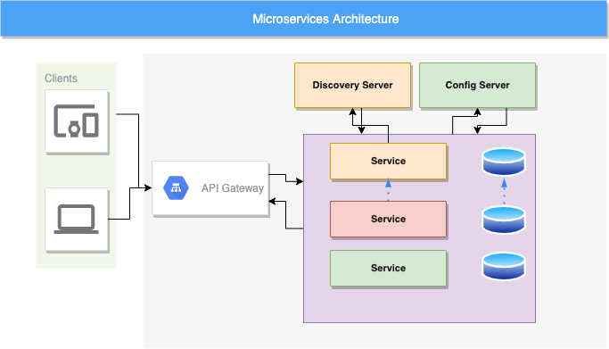
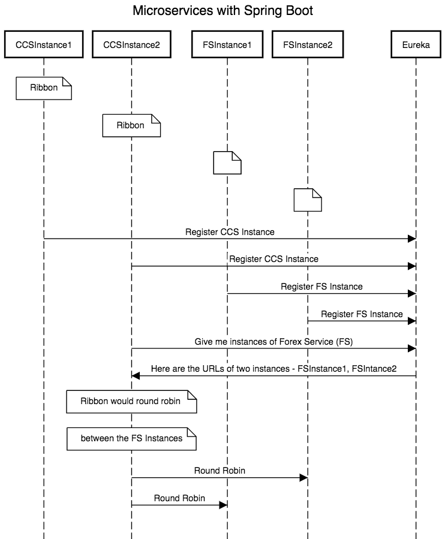

## Tech stack
- Java version: 17
- Maven version: 3.*
- Spring Boot version: 3.0.6

##What are microservices?
Microservices breaks a large application to different smaller parts, so it is easy to identify where the problem occurs and also if a component goes down it will not affect the whole application environment.
In this project, we will summarize the basics of building microservices with spring boot and spring cloud.
In a nutshell, microservices allow us to deliver application code in small and manageable pieces ,independent of others. 

##Microservices architecture
The concept of microservices is simple. It should break a large service with many small independent services. Let’s discuss some important points of microservices based on below architecture:

* Each microservice has its own database.
* Client API do not have direct access to the services. It can only interact through API gateway.
* We will register each service with the discovery server. The discovery has information of all the microservices available in the system.
* Configuration server contains all the configurations for the microservices and we will use this server to get configuration information like hostname, url etc. for our microservices.

##Generate project structure
Spring Initializer can be used: https://start.spring.io/

Spring Cloud provides solutions to cloud enable your microservices.
It leverages and builds on top of some of the Cloud solutions open sourced by Netflix (Netflix OSS).

Dynamic Scale Up and Down. Using a combination of
* Naming Server (Eureka)
* Ribbon (Client Side Load Balancing)
* Feign (Easier REST Clients)

Visibility and Monitoring with

* Zipkin Distributed Tracing
* Netflix API Gateway

Configuration Management with

* Spring Cloud Config Server

Fault Tolerance with

* Hystrix

All instances of the components (CCS and FS) register with the Eureka Naming Server. When FS needs to call the CCS, it will ask Eureka Naming Server for the active instances. We will use Ribbon to do Client Side Load Balancing between the different instances of FS.

A high level sequence diagram of what would happen when there is a request from CCS to FS is shown 

Ref: https://www.springboottutorial.com/creating-microservices-with-spring-boot-part-1-getting-started

